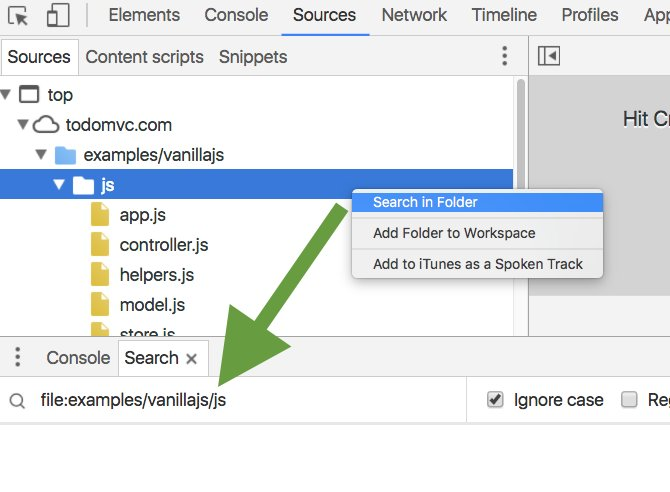

#### #Chrome# 2016-09-12：Chrome DevTools Tips
Chrome DevTools: Perform a site wide search for any code in the Sources Pane. Can also scope your searches with "file:"

原文地址: [dev-tips](https://umaar.com/dev-tips/)
