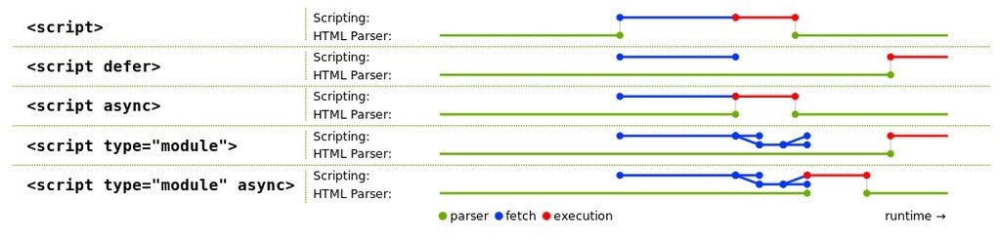

#### #JS# 2016-11-8：浏览器的script标签加载机制的解释

浏览器的<script>标签加载机制的解释

#### #JS# 2016-11-9：ES6 Module是动态的加载，导入的是变量的 只读引用 ，而不是拷贝

    // a.js
    export let a = 10;
    export let b = 10;
    export function add() {
      a = 15;
      b = 20;
      return a+b;
    };

    // b.js
    import {a, b, add} from './a.js';
    a+b;    // 20
    add();  // 35
    a+b;    // 35
